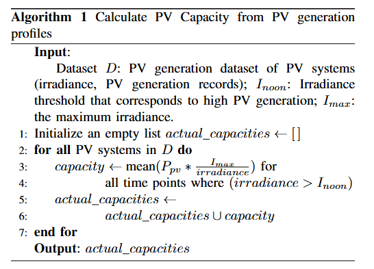
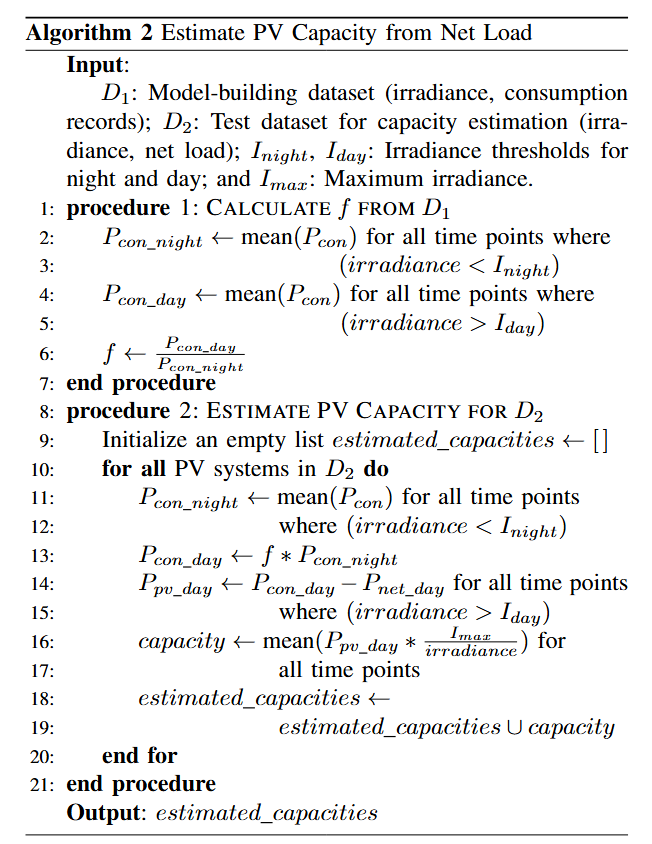

# Capacity Estimation Power Tech 2025
This repository contains the code for the paper "A Data-efficient Capacity Estimation Method for Behind-the-Meter Solar PV Systems", which was submitted to Power Tech 2025.

# Description of the Proposed Method

The schematic overview of the proposed method is shown in the following figure.


where the detailed description could be seen in the algorithm description below.

## Algorithmic Description


## Usage Instructions
First, install the dependencies using the requirements.txt file.
```
pip install -r requirements.txt
```
Second, put the file "Households in Amsterdam PV and demand data.xlsx" and "ams_weather_data.txt"under the path 'data/nl/'. If there is no such folder called 'data', create a folder called 'data' under the root directory, and then create a folder called 'nl' under the 'data' folder.

Third, run the following Jupyter notebooks in the order below, to obtain the results.
1. ams_data_explore.ipynb
2. ams_weather_explore.ipynb
3. ams_data_merge.ipynb
4. ams_data_preprocessing.ipynb
5. capacity_estimation_SA.ipynb
It is recommended to read through the notebooks to fully understand this project, also following the same order.

## In and Outs of the Jupyter Notebooks
ams_data_explore.ipynb:
input: 
1. Households in Amsterdam PV and demand data.xlsx

output: 
1. ams_data_energy.csv
2. ams_data_pv.csv
3. ams_data_con.csv
4. ams_data_net.csv

ams_weather_explore.ipynb:

input: 
1. ams_weather_data.txt
   
output: 
1. ams_data_weather_processed.csv

ams_data_merge.ipynb:

input: 
1. ams_data_energy.csv
2. ams_data_weather_processed.csv

output: 
1. ams_data_merged_unprocessed.csv


ams_data_preprocessing.ipynb:

input: 
1. ams_data_merged_unprocessed.csv

output: 
1. ams_data_merged_preprocessed.csv
2. ams_pv_capacity_from_pv_profiles.csv

capacity_estimation_SA.ipynb:

input:
1. ams_data_merged_preprocessed.csv
2. ams_pv_capacity_from_pv_profiles.csv

output: 
1. capacity_error_rate_part1.npy
2. capacity_error_rate_part2.npy