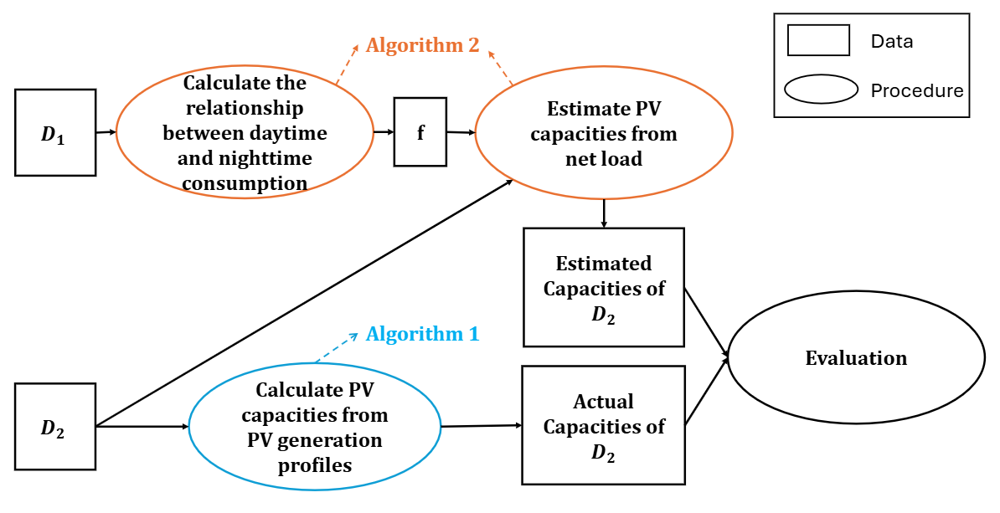

# Capacity Estimation Power Tech 2025
This repository contains the code for the paper "A Data-efficient Capacity Estimation Method for Behind-the-Meter Solar PV Systems", accepted by [IEEE Power Tech 2025](https://2025.ieee-powertech.org/).

# Structure of the project
`notebooks/` - contains the main notebooks that conduct the experiments.
`modules/` - contains the modules that are used in the experiments.
`figs/` - contains the figures of results of the experiments.
`data/` - contains the data used in the experiments.
`README.md` - this file, describing the project.

## Usage Instructions
1. Create a venv with `python -m venv env_name`.
2. Activate the venv with `source env_name/bin/activate`.
3. Install the dependencies with `pip install -r requirements.txt`.
4. Put the file "Households in Amsterdam PV and demand data.xlsx" and "ams_weather_data.txt"under the path 'data/nl/'. If there is no such folder called 'data', create a folder called 'data' under the root directory, and then create a folder called 'nl' under the 'data' folder.
5. Run the following Jupyter notebooks in the order below, to obtain the results.
   1. `ams_data_explore.ipynb`.
   2. `ams_weather_explore.ipynb`.
   3. `ams_data_merge.ipynb`.
   4. `ams_data_preprocessing.ipynb`.
   5. `capacity_estimation_SA.ipynb`.
Note that most of the results are obtained in the `capacity_estimation_SA.ipynb` notebook.

# Overview of the Proposed Method

The schematic overview of the proposed method is shown in the following figure.

# Disclaimer about the data
Due to the confidential requirements of the data provider, the original data used to obtain the results in the paper is not publicly available in this repository. However, it is encouraged to test the proposed method on your own data, which contains PV generation, consumption, net load, and weather data.

